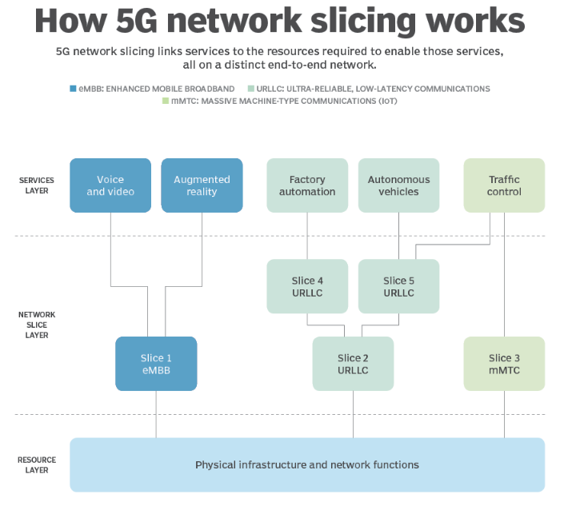
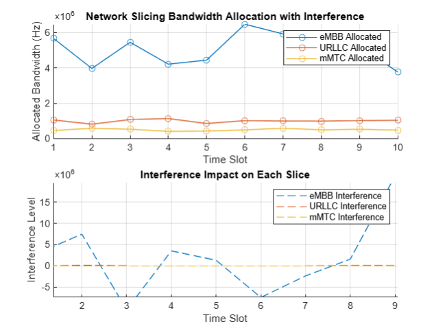
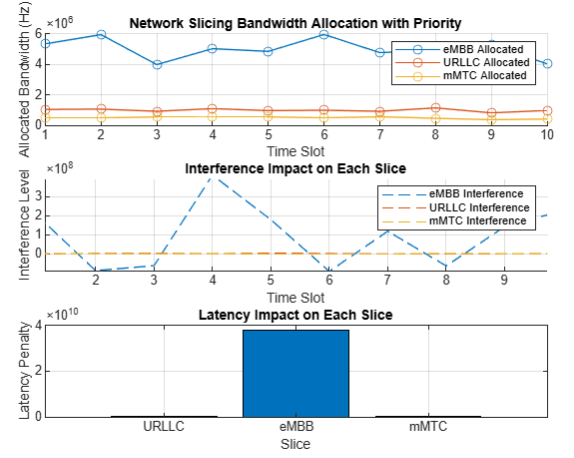

# 5G Network Slicing Simulation
The advent of 5G technology marks a significant leap in mobile communication, transforming how we connect and enabling a wide array of applications and services. 
From high-speed internet to smart cities, 5G is set to revolutionize industries. A key innovation that underpins this transformation is network slicing. 
This technology allows a single physical 5G network to be partitioned into multiple virtual networks, or "slices," each tailored to meet the specific needs of diverse applications. 
Each slice can offer unique combinations of bandwidth, latency, and reliability.

---

# Team Members
1. Arya Bhatt (202151028)
2. Divyanshu Sethiya (202151052)
3. Ujjwal Singh (202151158)
4. Swetha Balamurugan (202151168)
5. Hitt Bahal (202151194)

---

## Project Overview
This project explores the concept of network slicing through simulation. By modeling different slices (eMBB, URLLC, and mMTC), the project demonstrates dynamic resource allocation under varying traffic loads and interference conditions. 
The simulation reflects real-world challenges in managing 5G networks, such as traffic fluctuations and external interference. Visualizations of the simulation results provide insights into how network slicing efficiently allocates resources, ensuring quality of service (QoS) across slices, even under challenging conditions. 
This study highlights the potential of network slicing to support a diverse range of 5G-enabled applications.

### How does Network Slicing work ?

---

## Importance of network slicing
- **Resource Optimization:** Each slice can be allocated specific resources (bandwidth, latency, data rate) based on the needs of its applications, ensuring more efficient use of network resources.
- **Service Differentiation:** Slices can be customized for different industries, such as autonomous vehicles, IoT, and mobile broadband, allowing each service to receive the appropriate level of performance.
- **Flexibility and Scalability:** Network slices can be scaled and adapted dynamically in response to changing demands, ensuring that 5G networks remain agile in handling diverse workloads.
- **Reduced Latency and Improved QoS:** By isolating traffic for critical services, such as autonomous driving, network slicing can ensure lower latency and higher Quality of Service (QoS) for specific applications.

---

## Network Slicing and Resources
The simulation defines slice-specific parameters to emulate real-world scenarios:
- **Bandwidth:** eMBB: 50 MHz, URLLC: 10 MHz, mMTC: 5 MHz  
- **Latency:** eMBB: 20 ms, URLLC: 1 ms, mMTC: 50 ms  
- **Data Rate:** eMBB: 100 Mbps, URLLC: 1 Mbps, mMTC: 500 Kbps  

Interference is modeled as random noise, simulating unpredictable conditions. Each slice’s resources are adjusted dynamically based on interference levels.

---

## Traffic Simulation and Resource Allocation
Traffic patterns are generated dynamically, varying between 80% and 120% of each slice’s base data rate. The simulation adjusts resources by subtracting interference from the traffic load.

---

## Priority-Based Resource Allocation
Slices are assigned priorities to reflect their importance:
- **URLLC:** Highest priority  
- **mMTC:** Medium priority  
- **eMBB:** Lowest priority  

The allocation process prioritizes critical slices, ensuring sufficient resources for high-priority applications under heavy interference or traffic.

---

## Latency Impact Calculation
The simulation includes latency penalties to quantify performance degradation when traffic exceeds slice latency thresholds. These penalties are visualized to highlight their impact on network performance.

---

## Visualization and Analysis
The results are visualized with resource allocation, interference impact, and latency penalties for each slice. Below are the figures from the simulation:

  
*Figure 1: Resource allocation and interference impact across slices.*  

  
*Figure 2: Priority-based allocation and latency penalties.*

---

## Results and Discussion

### First Code Results
The first simulation treats all slices equally without prioritization. Results show uniform interference impact across slices, emphasizing the need for prioritization.

### Second Code Results and Improvements
The enhanced model incorporates:
- **Slice priorities**, favoring URLLC.
- **User mobility** for dynamic environments.
- **Latency penalties** to evaluate performance under heavy traffic.

Results show that priority-based allocation ensures critical slices maintain performance, while lower-priority slices like eMBB experience higher penalties under resource constraints.

### Comparison of Results
- **First Code:** Uniform resource allocation, interference impacts all slices equally.  
- **Second Code:** Priority-based allocation ensures high-priority slices like URLLC remain unaffected by resource constraints.
